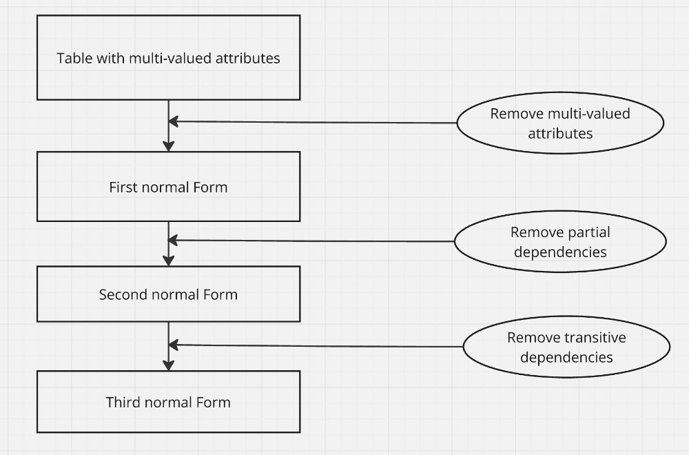
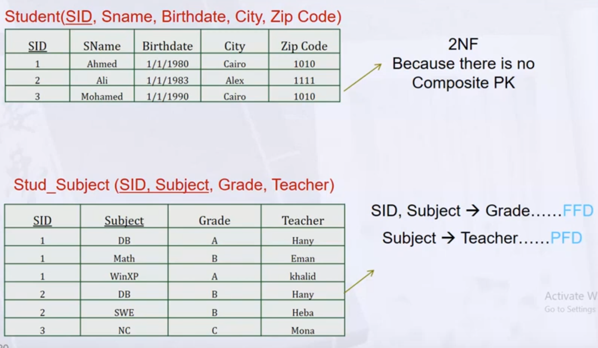

**DB Design** Consists of
- ERD
- Normalization 

#### Normalization
- The process of structuring data to minimize duplication and inconsistencies
- Breaking down a single table into two or more tables and defining relationships between tables
- Usually done in stages
#### Goals to avoid anomalies
-> **Insertion Anomaly**: adding new rows forces user to create duplication.

-> **Deletion Anomaly**: deleting rows may cause a loss of data that would be needed for other future rows.

-> **Modification anomaly**: Changing data in a row forces changes to other rows because of duplication.
#### Functional dependency
- A constraint between two attributes (columns) or two sets of columns
A -> B 
- if "for every valid instance of A, That value of A uniquely determines the value of B".
- or if"existing of B depending on a value of A".

"B depended on A"

SSN -> Ename

Pnum -> ProLocation

It's good when

A -> B,C,D

PK -> Columns

Sid -> name, age, address

**When I get PK I can get the rest**
#### Types of functional dependency
-> **Full functional Dependency**

- Attribute is fully functional dependency on a PK if its value determined by the Whole PK.

-> **Partial Functional Dependency**

- Attribute if has a Partial functional Dependency on a PK if its value is determined by a part of the pk (Composite Key).

-> **Transitive Functional Dependency**

- Attribute is transitive functional dependency on a table If its value is determined by another non-key attribute which it self determined by a PK.
#### Steps in normalization

#### Example Table

#### 1NF
-> Relation is in first normal form if it contains no multivalued or composite attributes.

-> Remove repeating groups to a new table as already demonstrated, "Carrying" the PK as a FK.

-> All columns (fields) must be atomic
- means: no repeating items in columns

#### 2NF
-> a relation is in second normal form if it is in first normal form and every non-key
attribute is fully functionally dependant on the primary key.

-> i.e. remove partial functional dependencies so non-key attribute depends on just part of the key.

#### 3NF
-> 2NF plus transitive dependencies (one attribute functionally determines second, which functionally determines third).

