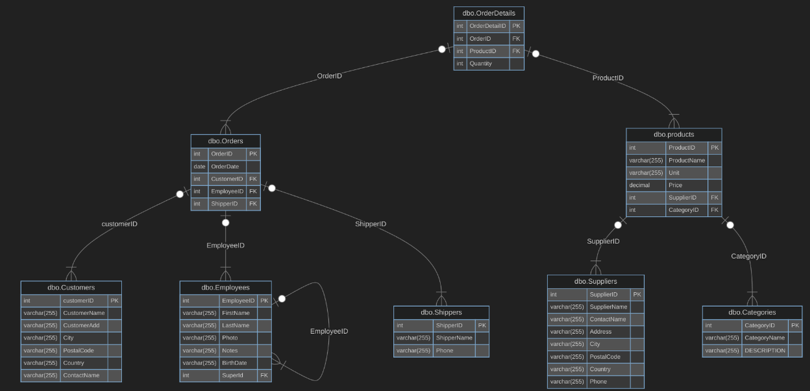

##### Join Multi Table
```sql
select ProductName, OrderDate, CustomerName
from Orders O, OrderDetails OD, Products P, Customers C
Where O.OrderID = OD.OrderID and P.ProductsID = OD.ProductID and C.customerID = O.CustomerID
```
The SQL query retrieves a list of product names, order dates, and customer names by joining four tables: `Orders`, `OrderDetails`, `Products`, and `Customers`. It uses the following conditions to link the tables:
1. **Orders** and **OrderDetails** are joined on `OrderID`.
2. **OrderDetails** and **Products** are joined on `ProductID`.
3. **Orders** and **Customers** are joined on `CustomerID`.
The result provides a combined view of each order, including the product details and the customer who placed the order. This query is useful for analyzing customer purchases and order history.

```sql
select ProductName, OrderDate, CustomerName
from Orders O inner join OrderDetails OD
	on O.OrderID = OD.OrderID
	inner join products P
	on P.ProductID = OD.ProductID
	inner join Customers C
	on C.customerID = O.CustomerID
```

This SQL query is a more modern and explicit version of the previous query, it retrieves **product names**, **order dates**, and **customer names** by explicitly joining four tables: `Orders`, `OrderDetails`, `Products`, and `Customers`. It uses **INNER JOIN** to combine the tables based on the following relationships:
1. **Orders** and **OrderDetails** are joined on `OrderID`.
2. **OrderDetails** and **Products** are joined on `ProductID`.
3. **Orders** and **Customers** are joined on `CustomerID`.
The result provides a clear view of each order, including the product details and the customer who placed it. This query is more readable and modern compared to the previous version, using explicit `INNER JOIN` syntax. It is useful for analyzing customer purchases and generating order-related reports.

##### Join with DML
```sql
UPDATE C
SET city = 'London'
FROM Customers C INNER JOIN Orders O 
ON C.customerID = O.CustomerID
WHERE C.city = 'Cairo';
```
1. **UPDATE C**: Updates the `Customers` table (aliased as `C`).
2. **SET city = 'Cairo'**: Changes the `city` to `'Cairo'` for matching rows.
3. **FROM Customers C**: Specifies the `Customers` table as the source for the update.
4. **INNER JOIN Orders O**: Joins the `Customers` table with the `Orders` table to ensure only customers with orders are updated.
5. **WHERE C.city = 'London'**: Filters the update to apply only to customers whose current city is `'London'`.


##### isnull
```sql
select isnull(st_fname, 'any string') as NewName
from student
```

Replaces the null with any string and can replace it with another column.

```sql
select isnull(st_fname. st_lname) as NewName -- we need to make alice because it's new column --
from student
```

##### coalesce
it function for multiple replacement if the another function is still null
```sql
select coalesce(st_fname, st_lname, st_address)
from student
```
It's alternative for isnull.

##### convert
```sql
select st_fname+' '+convert(varchar(2), st_age)
from student
```
Convert the different data type to the specific data type to concatenate .

##### concat
```sql
select isnull(st_fname, '') + ' ' +convert(varchar(2), isnull(st_age, 0))
from student
```
It's a lot of function and it will affect the performance so we have another function called concat.

```sql
select concat(st_fname,' ', st_age)
from Student
```
It convert automatically the datatypes and also remove any null and replace it with blank string.

##### Like
```sql 
select *
from Student
where st_fname = 'ahmed'
```
Use `=` for exact matches (e.g., `st_fname = 'ahmed'`).

```sql
select *
from student
where st_fname like 'ahm%' --- get all names that starts with ahm and enc with any characters
```
Use `LIKE` for pattern matching (e.g., `st_fname LIKE 'ahm%'` to find names starting with `'ahm'`).
```sql
_ one Char
% zero or More Char
```
Examples
```sql
select *
from Student
where st_fname like '_a%' -- get any name that starts with any char and after it 'a' follows with any chars--
```

```sql
'a%h' --- string starts with a and ends with h ---
'%a_' --- string before the end 'a' ---
'ahm%' --- starts with with 'ahm' ---
'[ahm]%' --- string starts with 'a' or 'h' or 'm' ---
'[^ahm]%' --- string doesn't start with 'a' or 'h' or 'm' ---
'[a-h]%' --- range, starts with any char between 'a' to 'h' ---
'[^a-h]%' --- doesn't start with this range ---
'[346]%' --- starts with 3 or 4 or 6 ---
'%[%]' --- string ends with '%' ---
'%[_]%' --- string _ in between 'ahmed_ali'
'[_]%[_]' --- starts with _ and ends with _ '_ahmed_'
```


##### order by
```sql
select st_fname, dept_id, st_age
from Student
order by 1
```
Order by the first column.

```sql
select st_fname, dept_id, st_age
from Student
order by dept_id asc, st_age desc
```
This SQL query retrieves `st_fname`, `dept_id`, and `st_age` from the `Student` table, sorting the results **first by `dept_id` in ascending order** and **then by `st_age` in descending order**. It groups students by department and lists older students first within each department.